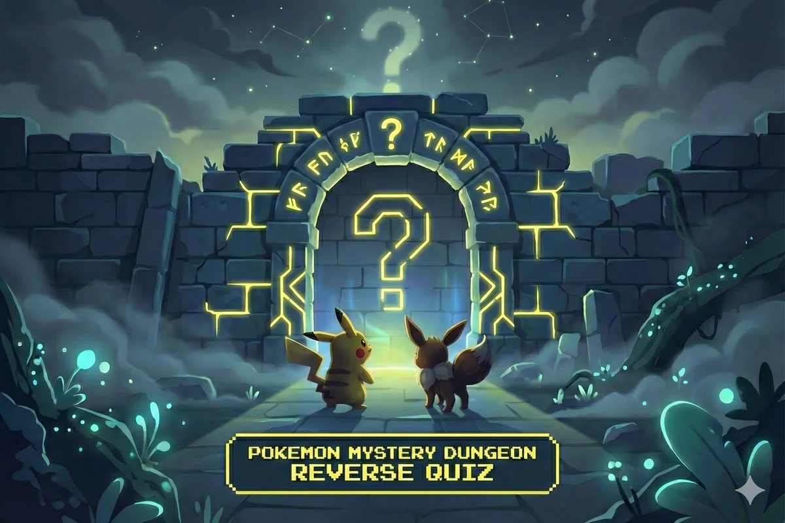

# PMD Reverse Quiz



A bilingual answer guide for the personality quizzes in classic **Pokémon Mystery Dungeon** games. Select a game, target Pokémon, and gender to see the required nature and which answers award the most points to it.

**Live demo:** https://pokemonmysterydungeon-reversequiz.netlify.app/

> The quizzes are randomized. This tool helps steer the score toward a target nature; it cannot guarantee a specific final result on every run.

## Supported games

- Pokémon Mystery Dungeon: Red Rescue Team / Blue Rescue Team
- Pokémon Mystery Dungeon: Explorers of Time / Darkness
- Pokémon Mystery Dungeon: Explorers of Sky

## What the tool does

- **Reverse lookup:** maps Pokémon + gender to the nature required by the selected game.
- **Answer guide:** highlights the answer(s) that give the most points to that nature for each possible question.
- **Full score visibility:** shows points awarded to competing natures as well.
- **Sky opening-question advice:** recommends Yes/No for the fixed Time/Darkness question. In Explorers of Sky, answering **Yes** adds +4 to the new-starter natures for the selected gender.
- **Search + bilingual UI:** English and Italian question search and interface.

## Accuracy and limitations

The starter/nature mappings were cross-checked against the current Bulbapedia personality-quiz tables. The Rescue Team dataset was also corrected during the 2026-09 audit: the missing fourth **Sassy** question was restored and an extraction error that had attached the gender answers to the final Miscellaneous question was removed.

The game itself does not present every question:

- **Red/Blue Rescue Team:** 8 questions are selected from different categories; the alien-invasion answer can trigger a follow-up question.
- **Explorers of Time/Darkness:** 8 questions are selected from 16 categories.
- **Explorers of Sky:** 8 questions are selected from 16 categories, plus the fixed opening Time/Darkness question. A **Yes** answer adds +4 to the new-starter natures for the chosen gender.

Because the final nature is determined by cumulative scores, random question selection, and possible ties, a locally optimal answer guide improves the odds but is not an exact solver for every possible quiz run.

### Reference data

- Bulbapedia — Personality Quiz (Mystery Dungeon): https://bulbapedia.bulbagarden.net/wiki/Personality_Quiz_(Mystery_Dungeon)
- StrategyWiki — Explorers of Sky personality test: https://strategywiki.org/wiki/Pok%C3%A9mon_Mystery_Dungeon:_Explorers_of_Sky/Personality_test

## Project structure

```
├── README.md
└── pmd-app/
    ├── public/
    │   ├── data/
    │   │   ├── questions_db.json
    │   │   ├── questions_db_it.json
    │   │   └── starters_map.json
    │   ├── pokemon-pics/
    │   └── hero-preview.webp
    ├── src/
    │   ├── components/
    │   ├── contexts/
    │   ├── utils/
    │   └── App.jsx
    └── package.json
```

## Local development

```bash
cd pmd-app
npm install
npm run dev
```

Production build:

```bash
npm run build
```

Full verification:

```bash
npm run check
```

This runs ESLint, structural dataset validation, and a production build.

## Stack

- React
- Vite
- Tailwind CSS
- JavaScript

## Disclaimer

This is an unofficial fan-made utility. Pokémon and related names/assets belong to their respective rights holders.
